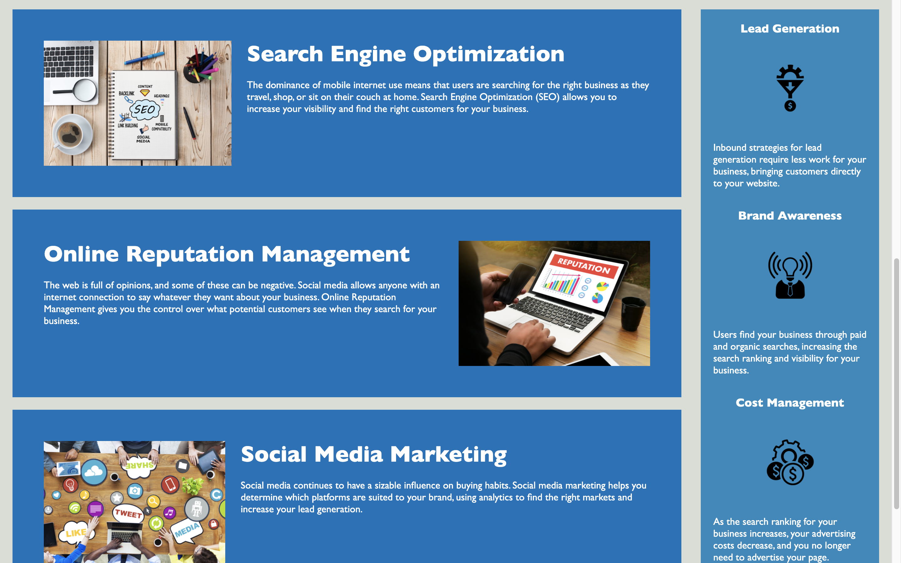

# Horiseo


## Description
- The **motivation** behind this project is to edit pre-existing code to utilize semantic elements while also organizing and refactoring repetitive code. We want to demonstrate an example of clean code.

- The **problem** this project aims to address is a landing page that does have semantic elements within the HTML document. By focusing on adding these features, web pages would become more user-friendly to those with disabilites. Also, by cleaning up the code structure and organization, readability for future developers would increase. 

- The **issues** we scouted for were:
 - [x] non-semantic elements that could be replaced with semantic elements offered in HTML5, such as `<nav>, <header>, <footer>, <section>, and <article>`,
 - [x] images that did not have descriptive alternative text attributes,
 - [x] HTML and CSS file disorganization and structure,
 - [x] broken or missing links, repetitive code, and missing comments before each new section.


## Screenshots
```md



```


## Links 
[repository] (https://github.com/cola-mars/horiseo)
[deployment] (https://cola-mars.github.io/horiseo/)


### Credit 
Code refactored by Nicola Marble.
